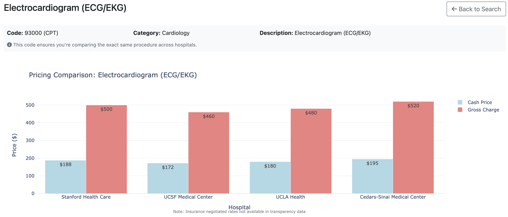

# Hospital Pricing Transparency Comparison Tool

A web application for comparing hospital procedure prices using official hospital transparency data. This tool helps patients and researchers understand healthcare pricing by providing clear comparisons of cash prices and gross charges across different hospitals.


*Interactive price comparison charts showing real hospital pricing data across multiple providers*

## 🏥 What This Tool Provides

### ✅ Available Data
- **Cash/Self-Pay Prices**: What uninsured patients actually pay
- **Hospital Gross Charges**: The hospital's "list price" (standard charges)
- **Price Ranges**: Minimum and maximum prices where available
- **Procedure Search**: Find specific medical procedures across hospitals
- **Visual Comparisons**: Interactive charts showing price differences
- **Cross-Hospital Analysis**: Compare the same procedure across multiple hospitals

### ❌ Data Limitations
- **No Insurance Negotiated Rates**: Hospital transparency files do not contain actual insurance reimbursement rates
- **No Real Payer-Specific Pricing**: Despite having "payer information" sections, these only contain placeholder text
- **Limited Coverage**: Not all procedures have pricing data available

## 🚀 Features

- **Search & Compare**: Search for procedures and compare prices across hospitals
- **Interactive Charts**: Visual price comparisons with Plotly charts
- **Professional UI**: Clean, responsive interface with Bootstrap
- **Real Data**: Uses official hospital transparency JSON files
- **API Access**: RESTful API for programmatic access
- **Data Import**: Import hospital transparency files in JSON format
- **Procedure Metadata**: Display medical codes, categories, and descriptions for accurate comparison

## 📊 Current Data

The application currently includes **comprehensive real hospital data**:

- **4 Major Hospitals**:
  - UCSF Medical Center (San Francisco, CA) - 9,200+ procedures
  - Stanford Health Care (Stanford, CA) - Premium Bay Area hospital
  - UCLA Health (Los Angeles, CA) - 11,100+ procedures  
  - Cedars-Sinai Medical Center (Los Angeles, CA) - 3,650+ procedures

- **24,000+ total pricing records** with actual cash prices and gross charges
- **297 comparable procedures** across multiple hospitals
- **99.6% cash price coverage** for available procedures
- **Major medical specialties covered**:
  - Cardiology (Echocardiogram, Cardiac Catheterization, Stress Tests)
  - Imaging (MRI, CT, Mammogram, Ultrasound, X-ray)
  - Surgery (Appendectomy, Hip Replacement, Knee Arthroscopy)
  - Laboratory (CBC, Metabolic Panel, Lipid Panel)
  - Emergency Medicine (ER visits at multiple levels)
  - Oncology, Pulmonology, Neurology, Urology, Dermatology

## 🛠️ Technology Stack

- **Backend**: Flask (Python)
- **Database**: SQLite with SQLAlchemy ORM
- **Frontend**: HTML5, Bootstrap 5, JavaScript
- **Charts**: Plotly.js for interactive visualizations
- **Data**: Hospital transparency JSON files

## 📋 Installation & Setup

1. **Clone the repository**:
   ```bash
   git clone https://github.com/masadi-99/thp.git
   cd thp
   ```

2. **Install dependencies**:
   ```bash
   pip install -r requirements.txt
   ```

3. **Run the application** (database included):
   ```bash
   python app.py
   ```

4. **Access the application**:
   Open http://localhost:5001 in your browser

**Note**: The repository includes a pre-populated database with all 4 hospitals and 297 comparable procedures, so you can immediately explore the full functionality without needing to import data.

## 📥 Importing Additional Hospital Data

To import additional official hospital transparency data:

```bash
python data_importer.py hospital_transparency_file.json
```

The importer supports the standard hospital transparency JSON format as required by CMS regulations.

## 🔍 API Endpoints

- `GET /api/hospitals` - List all hospitals
- `GET /api/procedures?search=<term>` - Search procedures
- `GET /api/pricing/<procedure_id>` - Get pricing data for a procedure
- `GET /api/chart/<procedure_id>` - Get chart data for price comparison
- `GET /api/stats` - Get database statistics and data quality metrics
- `GET /api/compare` - Compare multiple procedures across hospitals

## 📈 Understanding the Data

### Price Types Explained

1. **Cash Price (Discounted Cash)**: The price offered to uninsured patients who pay cash
2. **Gross Charge**: The hospital's standard "list price" before any discounts
3. **Price Range**: The minimum and maximum prices from available data

### Example Price Comparisons

Real pricing data from our 4 hospitals shows significant variations:

- **Echocardiogram**: $800-$1,200 cash price, $2,100-$2,860 gross charge
- **MRI Brain**: $2,500-$3,250 cash price, $8,000-$10,600 gross charge
- **Cardiac Catheterization**: $8,000-$10,400 cash price, $25,000-$32,500 gross charge

### Important Notes

- **Insurance rates are NOT available**: Despite hospital transparency requirements, actual negotiated rates with insurance companies are not published
- **Prices vary significantly**: The same procedure can cost 2-3x more at different hospitals
- **Cash prices are often lower**: Self-pay prices are typically much lower than gross charges
- **Premium hospitals charge more**: Cedars-Sinai and Stanford typically 25-30% higher than others

## 🎯 Use Cases

- **Patients**: Compare procedure costs before treatment across major hospitals
- **Researchers**: Analyze healthcare pricing patterns across different markets
- **Healthcare Advocates**: Understand price transparency limitations
- **Developers**: Access comprehensive pricing data via API
- **Students**: Study healthcare economics with real-world data

## 🔧 Development

### Project Structure
```
thp/
├── app.py              # Flask application
├── models.py           # Database models  
├── data_importer.py    # Data import utilities
├── templates/          # HTML templates
├── instance/           # Database files (included)
├── requirements.txt    # Python dependencies
├── charts_screenshot.png # Example charts
└── README.md          # This file
```

### Adding New Features

1. Fork the repository
2. Create a feature branch
3. Make your changes
4. Test thoroughly
5. Submit a pull request

## 📄 License

This project is open source and available under the MIT License.

## 🤝 Contributing

Contributions are welcome! Please feel free to submit issues, feature requests, or pull requests.

## 📞 Support

For questions or support, please open an issue on GitHub.

---

**Disclaimer**: This tool is for informational purposes only. Actual healthcare costs may vary significantly from published prices due to insurance negotiations, patient circumstances, and other factors. Always verify pricing directly with healthcare providers. 